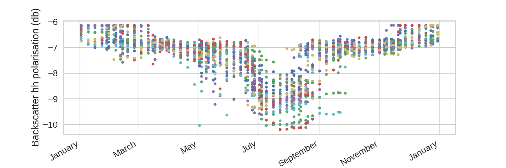
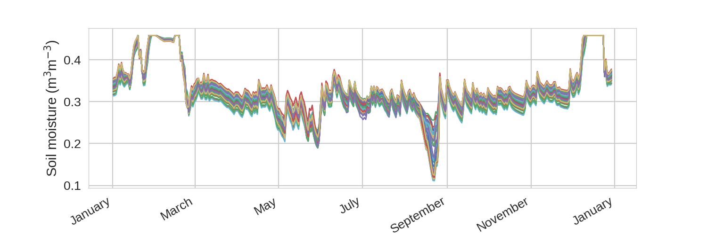
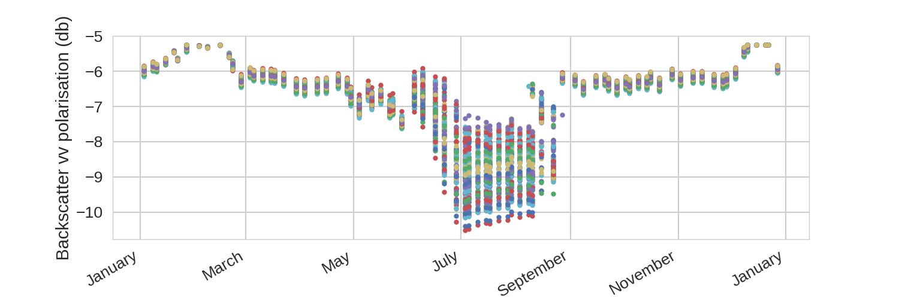
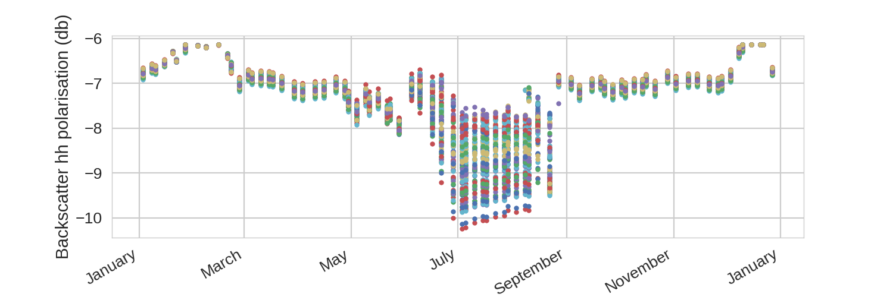

Sensitivty analysis
===================

Climatological sensitivity
--------------------------

Below are examples of the Sentinel Simulator's sensitivity to climatological forcing data.

Biophysical variables
~~~~~~~~~~~~~~~~~~~~~

.. image:: sensitivity/lai.png
    :width: 600px
    :height: 200px

.. image:: sensitivity/can_ht.png
    :width: 600px
    :height: 200px

Sentinel 1 output
~~~~~~~~~~~~~~~~~

.. image:: sensitivity/vv.png
    :width: 600px
    :height: 200px

.. image:: sensitivity/hv.png
    :width: 600px
    :height: 200px

Sentinel 2 output
~~~~~~~~~~~~~~~~~

.. image:: sensitivity/B1.png
    :width: 600px
    :height: 200px

.. image:: sensitivity/B2.png
    :width: 600px
    :height: 200px

.. image:: sensitivity/B4.png
    :width: 600px
    :height: 200px

.. image:: sensitivity/B6.png
    :width: 600px
    :height: 200px

.. image:: sensitivity/B7.png
    :width: 600px
    :height: 200px

.. image:: sensitivity/B9.png
    :width: 600px
    :height: 200px

.. image:: sensitivity/B10.png
    :width: 600px
    :height: 200px

.. image:: sensitivity/B11.png
    :width: 600px
    :height: 200px

Parameter sensitivity
---------------------

Below are examples of the Sentinel Simulator's sensitivity to JULES land surface model parameters. Here we are varying
crop sow date, crop nitrogen use efficiency, soil moisture wilting point and the Brooks and Corey exponent factor for
soil moisture.

Biophysical variables
~~~~~~~~~~~~~~~~~~~~~

Sentinel 1 output
~~~~~~~~~~~~~~~~~

.. image:: sensitivity/parameter/hv.png
    :width: 600px
    :height: 200px

Sentinel 2 output
~~~~~~~~~~~~~~~~~

.. image:: sensitivity/parameter/B2.png
    :width: 600px
    :height: 200px

.. image:: sensitivity/parameter/B4.png
    :width: 600px
    :height: 200px

.. image:: sensitivity/parameter/B5.png
    :width: 600px
    :height: 200px

.. image:: sensitivity/parameter/B6.png
    :width: 600px
    :height: 200px

.. image:: sensitivity/parameter/B7.png
    :width: 600px
    :height: 200px

.. image:: sensitivity/parameter/B9.png
    :width: 600px
    :height: 200px

.. image:: sensitivity/parameter/B12.png
    :width: 600px
    :height: 200px