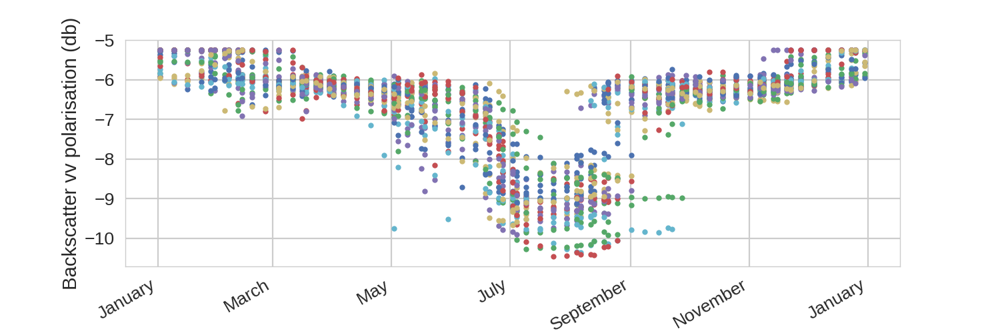
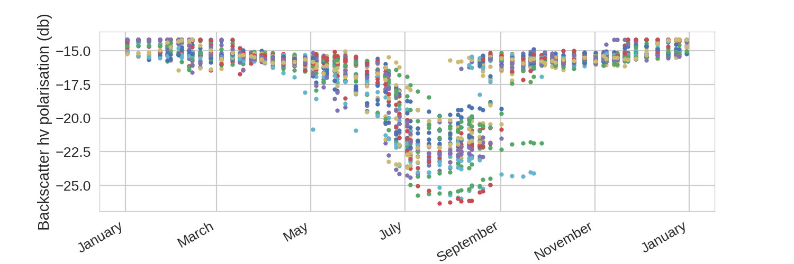

Sensitivty analysis
===================

Below are examples of the Sentinel Simulator's sensitivity to climatological forcing data.

Biophysical variables
---------------------

.. image:: sensitivity/lai.png
    :width: 600px
    :height: 200px

.. image:: sensitivity/can_ht.png
    :width: 600px
    :height: 200px

.. image:: sensitivity/soil_m.png
    :width: 600px
    :height: 200px

Sentinel 1 output
-----------------

.. image:: sensitivity/hh.png
    :width: 600px
    :height: 200px

Sentinel 2 output
-----------------

.. image:: sensitivity/B1.png
    :width: 600px
    :height: 200px

.. image:: sensitivity/B2.png
    :width: 600px
    :height: 200px

.. image:: sensitivity/B3.png
    :width: 600px
    :height: 200px

.. image:: sensitivity/B5.png
    :width: 600px
    :height: 200px

.. image:: sensitivity/B8.png
    :width: 600px
    :height: 200px

.. image:: sensitivity/B8A.png
    :width: 600px
    :height: 200px

.. image:: sensitivity/B9.png
    :width: 600px
    :height: 200px

.. image:: sensitivity/B10.png
    :width: 600px
    :height: 200px

.. image:: sensitivity/B12.png
    :width: 600px
    :height: 200px